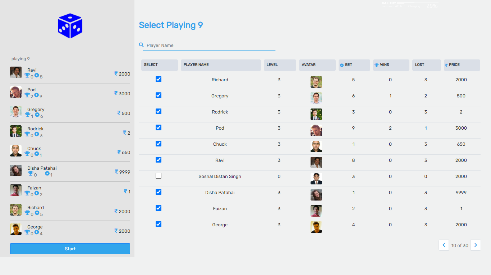
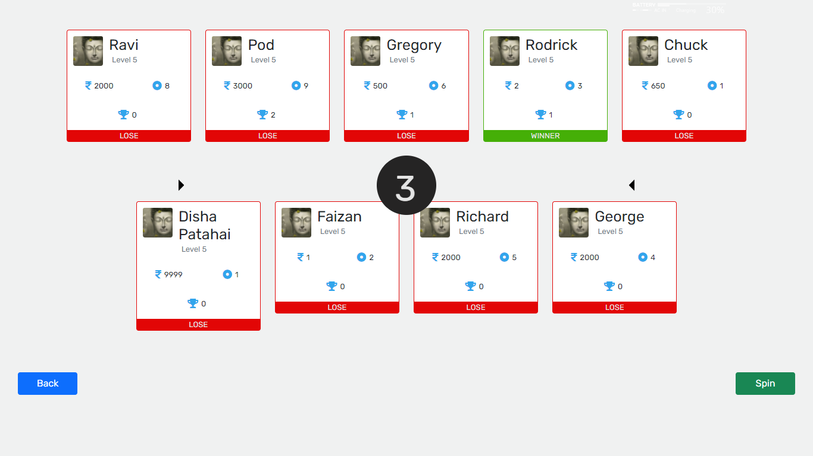

# BetCube

A platform for betting with random number between 1 to 9

## Team

- [Mayur Bhowad](https://github.com/MayurBhowad "Mayur's Github")

## Deployed App

https://betcube.herokuapp.com/

## Table of Contents

1. [Usage](#Usage)
1. [Requirements](#requirements)
1. [Development](#development)
   1. [Installing Dependencies](#installing-dependencies)
   1. [Tasks](#tasks)
1. [Roadmap](#roadmap)
1. [Contributing](#contributing)

## Usage

This repo is meant to be used in-browser by a target audience.

## Requirements

- "node": 6.4.x
- "axios": "^0.21.1",
- "body-parser": "^1.19.0",
- "cors": "^2.8.5",
- "express": "^4.17.1",
- "lodash": "^4.17.20",
- "mongoose": "^5.11.11",
- "prop-types": "^15.7.2",
- "react": "^17.0.1",
- "react-dom": "^17.0.1",
- "react-redux": "^7.2.2",
- "react-router-dom": "^5.2.0",
- "react-scripts": "4.0.1",
- "redux": "^4.0.5",
- "redux-thunk": "^2.3.0",
- "web-vitals": "^0.2.4"

## Development

### Installing Dependencies

From within the root directory:

with npm

```sh
npm install
```

with yarn

```sh
yarn install
```

### Tech Stack

#### Front-end

- ReactJs
- React Routers
  - Dynamic URL routing is handled using React Routers

#### Back-end

- Node
  - for serving reactJs build app

#### Preview 01 (Home Page)



#### Preview 02 (Betting Table)


